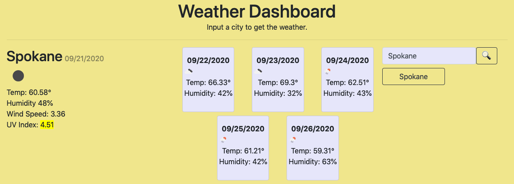

# weather-forcast-dashboard

A weather dashboard that allows the user to search for a city and then returns the current weather plus a 5-day forecast for that city.

## Tech

The app takes advantage of the openWeather api to get the weather information for both the current weather, 5 day forecast and the weather icon. It utilizes Bootstrap to create a mobile friendly site and jQuery for DOM manipulation and AJAX requests.

## Live Site
https://mercspring.github.io/weather-forcast-dashboard/